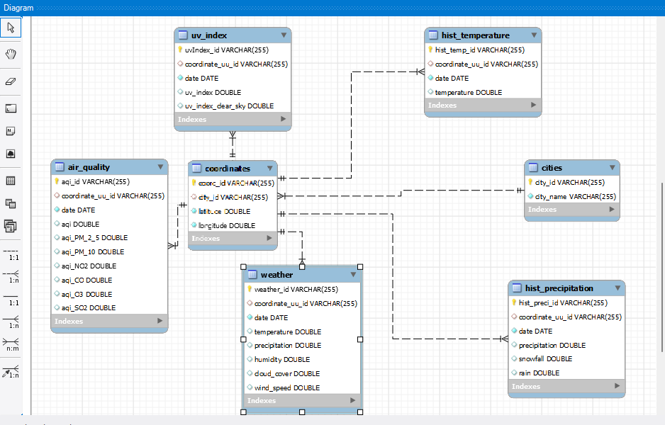
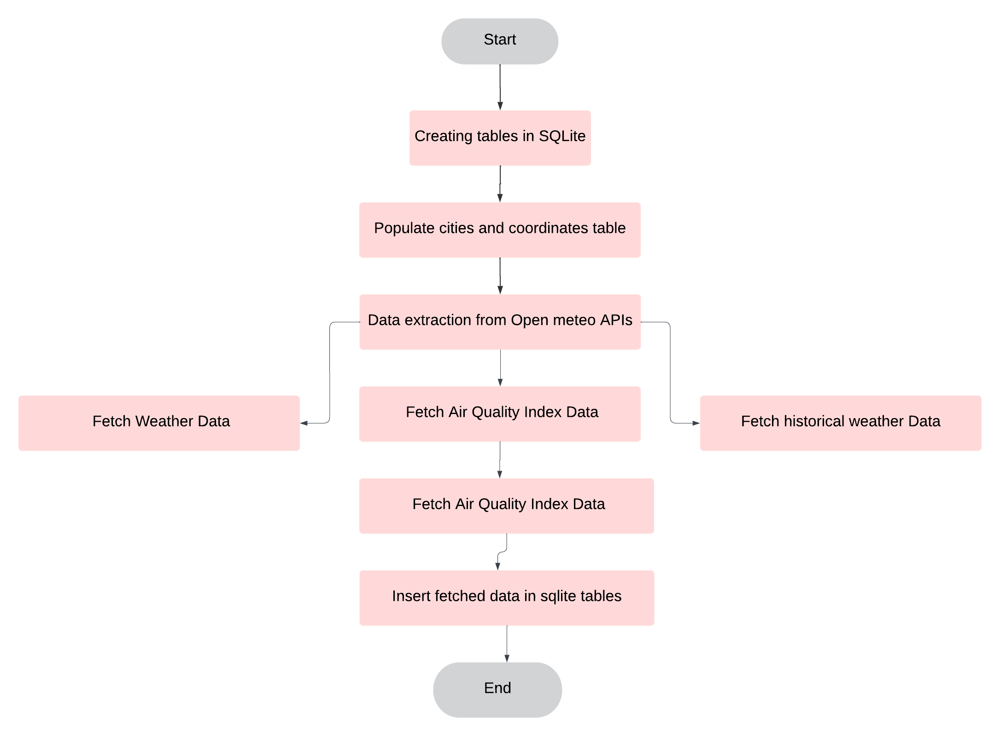

# Weather Use Case Documentation

## Description of the Use Case

This use case focuses on the usage of advanced Python SQL data cleaning concepts, Airflow, and running the workflows in a Docker container. The objective is to fetch required data from certain feasible APIs, perform data cleaning operations on the fetched data, and insert the data into a MySQL database. This workflow is defined and implemented in an Airflow DAG within a Docker container.

## APIs Used

- **Open Meteo Weather Forecast API**:  
  `https://api.open-meteo.com/v1/forecast?latitude=52.52&longitude=13.41&hourly=relative_humidity_2mprecipitationcloud_coverwind_speed_180mtemperature_180muv_indexuv_index_clear_sky&forecast_days=1`

- **Open Meteo Air Quality Index API**:  
  `https://air-quality-api.open-meteo.com/v1/air-quality?latitude=52.52&longitude=13.41&hourly=us_aqius_aqi_pm2_5us_aqi_pm10us_aqi_nitrogen_dioxideus_aqi_carbon_monoxideus_aqi_ozoneus_aqi_sulphur_dioxide&forecast_days=1`

- **Open Meteo Historical Weather Data API**:  
  `https://archive-api.open-meteo.com/v1/archive?latitude=52.52&longitude=13.41&start_date=2022-01-01&end_date=2023-06-01&hourly=temperature_2mprecipitationrainsnowfall`

## Resources Used

- Open Meteo’s in-built API response codebase
- Open Meteo’s requests SDK package
- Open Meteo’s requests cache and retry-requests packages
- `cities.json` - contains a list of Indian cities in JSON format 

## Tech Stack Used

- **Python**: Pandas, Flask
- **SQLite**
- **MySQL**
- **Airflow**
- **Docker**

## Table Structure

1. **cities**
   - `city_id` (primary key)
   - `city_name`

2. **coordinates**
   - `coord_id` (primary key)
   - `city_id` (references `cities(city_id)`)
   - `latitude`
   - `longitude`

3. **weather**
   - `weather_id` (primary key)
   - `coordinate_uu_id` (references `coordinates(coord_id)`)
   - `date`
   - `temperature`
   - `precipitation`
   - `humidity`
   - `cloud_cover`
   - `wind_speed`

4. **air_quality**
   - `aqi_id` (primary key)
   - `coordinate_uu_id` (references `coordinates(coord_id)`)
   - `date`
   - `aqi`
   - `aqi_PM_2_5`
   - `aqi_PM_10`
   - `aqi_NO2`
   - `aqi_CO`
   - `aqi_O3`
   - `aqi_SO2`

5. **uv_index**
   - `uvIndex_id` (primary key)
   - `coordinate_uu_id` (references `coordinates(coord_id)`)
   - `date`
   - `uv_index`
   - `uv_index_clear_sky`

6. **hist_temperature**
   - `hist_temp_id` (primary key)
   - `coordinate_uu_id` (references `coordinates(coord_id)`)
   - `date`
   - `temperature`

7. **hist_precipitation**
   - `hist_preci_id` (primary key)
   - `coordinate_uu_id` (references `coordinates(coord_id)`)
   - `date`
   - `precipitation`
   - `snowfall`
   - `rain`

## ERD Diagram

## Workflow

There are two DAGs in Airflow which will run one after the other:
1. **First DAG**: Performs tasks of data extraction from API and insertion into created SQLite tables.
2. **Second DAG**: Extracts the data from SQLite tables, performs transformations on them, and then loads the cleaned data into MySQL database tables.

### Flow Chart of First DAG

### Flow Chart of Second DAG

